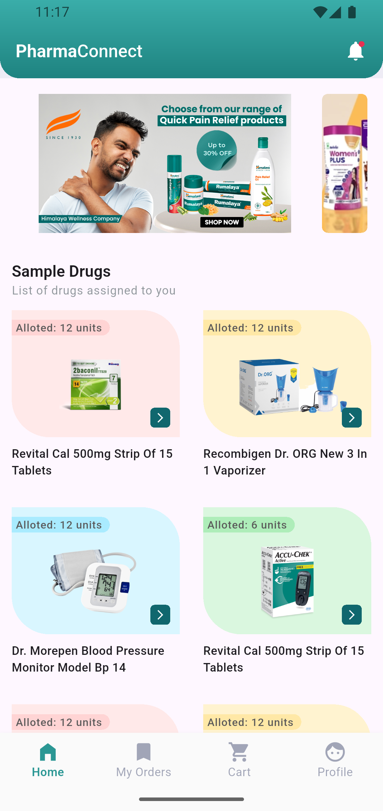
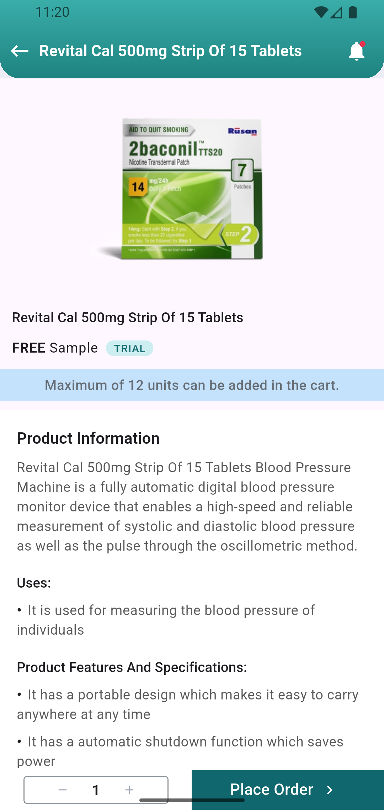
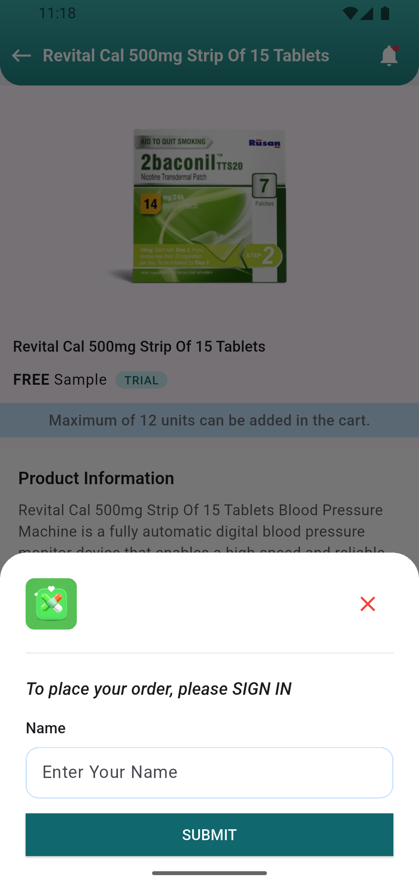
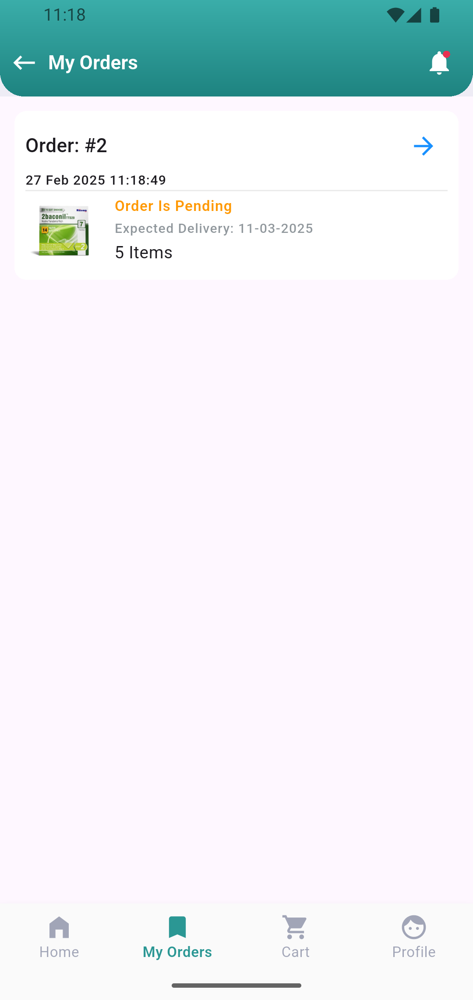
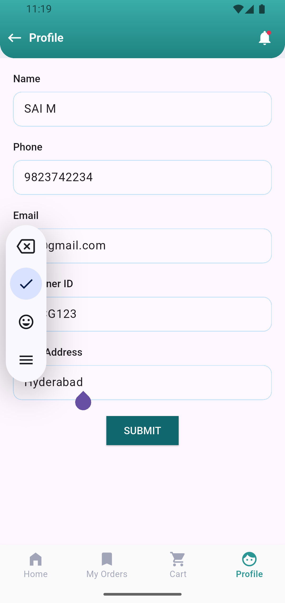

<p align="left" style="display: inline-flex; align-items: center; background-color: white; padding: 5px; border-radius: 5px;">
  
  <span style="font-size: 24px; font-weight: bold; margin-left: 10px; color: #10676E;">PharmaConnect</span>
</p>

<br />

This app implements the BLoC (Business Logic Component) pattern for state management, providing a clean separation of concerns. Users can browse products, view details, and place orders. The Edit Profile screen allows users to update and save their details to Firebase, with data being automatically populated when they return. BLoC manages the state of the app, ensuring smooth interactions and consistent data flow between UI and Firebase.

## Flutter Doctor
```dart
[✓] Flutter (Channel stable, 3.29.0, on macOS 15.0 24A8332 darwin-arm64, locale en-US) [862ms]
    • Flutter version 3.29.0 on channel stable at /opt/homebrew/Caskroom/flutter/3.27.3/flutter
    • Upstream repository https://github.com/flutter/flutter.git
    • Framework revision 35c388afb5 (2 weeks ago), 2025-02-10 12:48:41 -0800
    • Engine revision f73bfc4522
    • Dart version 3.7.0
    • DevTools version 2.42.2
```
<br />
<br />

 



